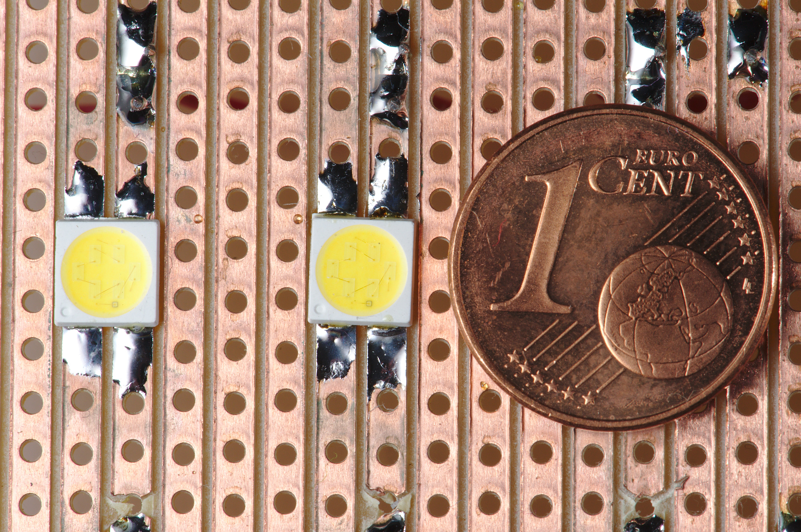
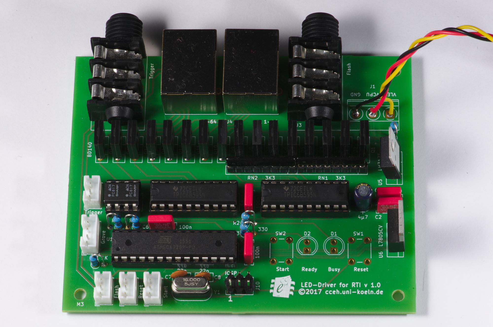
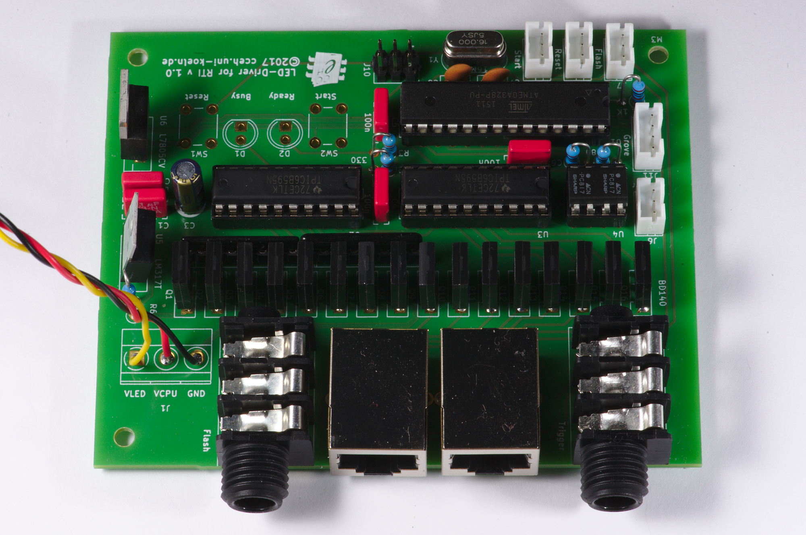
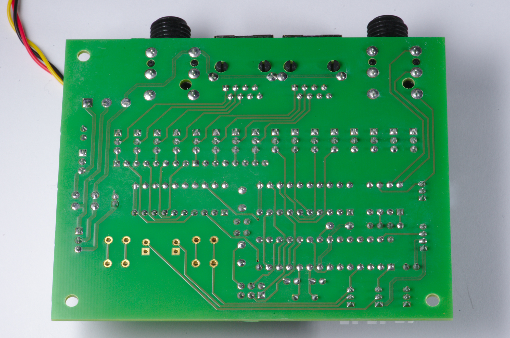
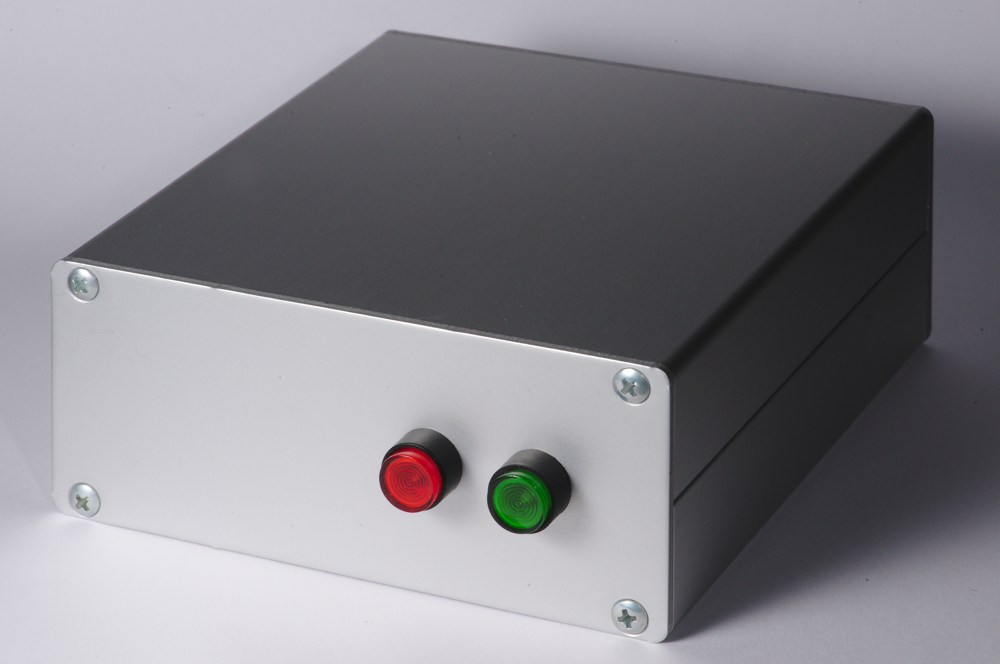
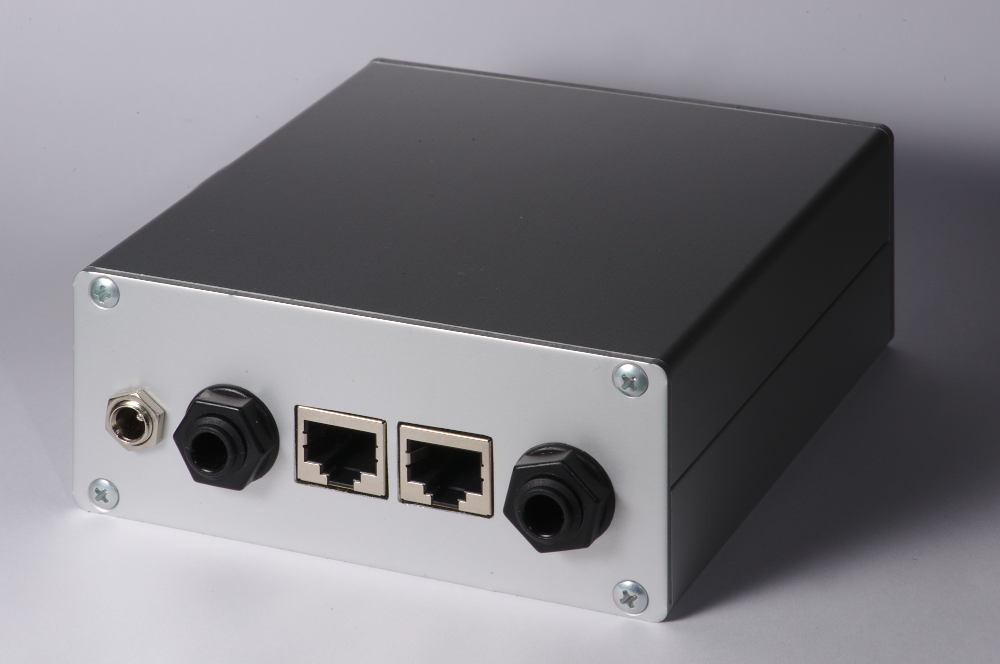
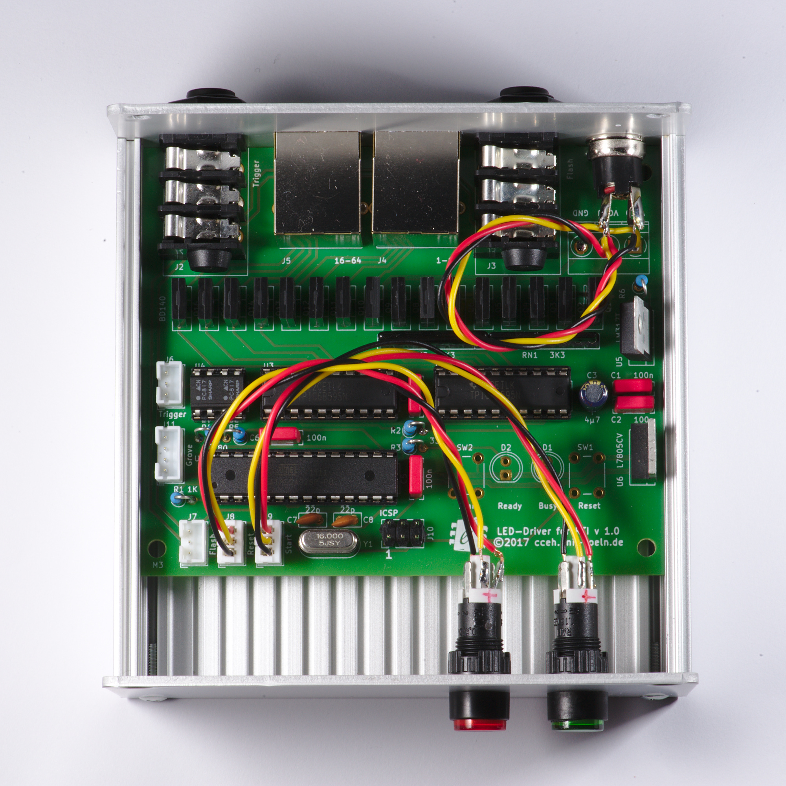

Electrical Design
=================

The main goals of this design were:

- to use bright and affordable LEDs,
- to use only user-solderable off-the-shelf components,
- the dome should look to the camera like an ordinary flash gun,
- the dome should work with any camera using standard interfaces.

Overview
--------

While researching affordable RTI domes on the internet we found electrical
designs like this: [#]_ [#]_

.. pic:: pic
   :caption: Typical design found on the internet

   right;

   box "user must" "set timing" note;
   arrow astyle;
   CTRL: box "Controller" component;
   arrow 1 "shutter" above astyle;
   CAM: box "Camera" external;
   line <- astyle;
   box "user must" "set exposure" note;

   move to CTRL.s; down;
   arrow astyle "step" rjust;

   DRV: box "LED Driver" component;
   move to DRV.e; right;
   arrow 1 astyle;
   DOME: box "Dome" external;

   box dashed width 1.6 height 1.8 with .n at CTRL.n + (0, 0.15)

The camera is in single-shot mode.  The controller tells the LED driver to turn
on the next LED and then presses the camera shutter button.  The camera takes
one picture.  After a programmable time lapse the controller releases the
shutter button and tells the LED driver to turn the LED off.  After another
programmable interval the cycle starts again, as many times as there are LEDs in
the dome.

.. pic:: uml
   :caption: Typical design sequence diagram

   actor User               as u
   participant Controller   as ctrl
   participant Camera       as cam
   participant "LED Driver" as drv
   participant Dome         as dome

   u -> cam  : set exposure
   u -> ctrl : set sleeping interval 1
   u -> ctrl : set sleeping interval 2
   u -> ctrl : push start button

   loop on all LEDs in dome
   ctrl -> drv  : turn LED on
   drv  -> dome : turn LED on
   activate dome
   ctrl -> cam  : press shutter
   activate ctrl
   activate cam
   |||
   hnote over cam  : taking exposure
   hnote over ctrl : sleeping interval 1
   |||
   dome -[#transparent]> drv
   deactivate cam
   dome -[#transparent]> drv
   activate cam #ccc
   ctrl -> cam : release shutter
   deactivate ctrl
   ctrl -> drv : turn LED off
   activate ctrl #ccc
   drv -> dome : turn LED off
   deactivate dome
   hnote over cam  : saving picture
   hnote over ctrl : sleeping interval 2
   |||
   drv -[#transparent]> dome
   deactivate cam
   |||
   drv -[#transparent]> dome
   deactivate ctrl
   end

This is sub-optimal because the controller does not know when the camera is done
with the current exposure nor when it is ready to take the next exposure.  This
depends on the exposure time, the size of the picture file, the speed of the
camera memory system, and many other things.  The optimal intervals can only be
found by experiment.  You must program generous intervals because if any
interval is too short the camera will miss exposures and you will get an
unusable set of pictures.

The CCeH driver module takes a different approach that does not have these
disadvantages.

..
   defcolor lightyellow rgb #fefece
   defcolor yellow rgb #fbfb77
   defcolor red rgb #a80136

.. pic:: pic
   :caption: CCeH design

   right;

   CTRL: box "Controller" component;
   arrow 1 astyle "shutter" above;
   CAM: box "Camera" external;
   line <- astyle;
   box "user must" "set exposure" note;

   move to CTRL.s; down;
   line <- astyle "done" rjust;

   DRV: box "LED Driver" component;
   move to DRV.e; right;

   arrow 1 astyle;
   DOME: box "Dome" external;

   move to 1/2 <CAM.sw,CAM.s>;
   spline .6 down 0.25 then left 1.65 then down 0.25 -> astyle;

   move to 1/2 <CAM.c,DRV.c>;
   "flash" above;

   box dashed width 1.6 height 1.8 with .n at CTRL.n + (0, 0.15)

In the CCeH design you don't need to program any interval into the controller
because the camera itself tells the controller what to do.  The system will go
as fast as the camera allows and never miss an exposure.

The camera is in continuous-shot mode.  The controller presses the camera
shutter button and keeps it pressed.  The camera initializes and when it is
about to take an exposure it signals this on its external flash output.  The LED
driver listens to this signal and turns on the next LED.  When the camera is
done with the exposure it resets the flash output and the driver turns off the
LED.  The camera saves the picture.  This flash cycle repeats until all LEDs
have flashed.  Then the LED driver will tell the controller to release the
shutter button and the camera will stop.

.. pic:: uml
   :caption: CCeH design sequence diagram

   actor User               as u
   participant Controller   as ctrl
   participant Camera       as cam
   participant "LED Driver" as drv
   participant Dome         as dome

   u -> cam  : set exposure
   u -> ctrl : push start button

   ctrl -> cam : press shutter

   loop on all LEDs in dome
   cam -> drv  : flash on
   activate cam
   drv -> dome : turn LED on
   activate dome
   hnote over cam : taking exposure
   |||
   cam -> drv  : flash off
   deactivate cam
   drv -> dome : turn LED off
   deactivate dome
   activate cam #ccc
   |||
   hnote over cam : saving picture
   |||
   drv -[#transparent]> dome
   deactivate cam
   end

   drv  -> ctrl : last LED
   ctrl -> cam  : release shutter

This design conserves energy, because the LEDs are turned on only for the time
needed to take the exposure, and turned off during the time the camera processes
and stores the image.  You want this in battery-powered domes.

Choice of LED
-------------

Consider the following points before selecting an LED make.

Performance:

  Luminous LEDs allow fast work and great focal depth.  Look for LEDs specified
  to 100 lm (lumen) or more.

Light quality:

  Especially important if you want to take color pictures.  Look for a Color
  Rendering Index (CRI) of 90 or more.

Price:

  High performance LEDs are expensive.

Mounting:

  High performance LEDs are designed for reflow soldering, which makes them hard
  to solder by hand.  You must solder each LED to a small board before you can
  use them or buy them pre-soldered (expensive).  Test your ability to solder
  the LED make before buying quantities.

This is a choice of LED makes (as of 2017).

========== ========================== ====  ==== === ==== ==== ====== ======= =============
Series     Part.No.                     lm     V  mA Case    € MinQty Distr.  No
========== ========================== ====  ==== === ==== ==== ====== ======= =============
Duris S 10 GW P7LP32.EM-RSRU-XX52-1   1400  38.0 300 7070 1.90     50 RS      8792889
Duris S 10 GW P7LM32.EM-QURQ-XX52-1   1050  28.5 300 7070 1.72     50 Mouser
Duris S 8  GW P9LT31.EM-PSPU-XX52-1    610  31.0 150 5050 0.96     25 DigiKey 475-3200-1-ND
Duris S 8  GW P9LT32.EM-PSPU-XX52-1    610   6.2 750 5050 0.96     25 DigiKey 475-3207-1-ND
Duris S 8  GW P9LR31.EM-PQPS-XX52-1    500  24.8 150 5050 0.76     25 DigiKey 475-3187-1-ND
Duris S 8  GW P9LR32.EM-PQPS-XX52-1    500   6.2 600 5050 0.80     25 DigiKey 475-3193-1-ND
Duris S 8  GW P9LMS1.EM-NSNU-57S5-0    395  19.8 200 4SMD 0.91     50 RS      8108054
Duris S 8  GW P9LMS2.EM-NQNS-57S5-0    350  19.8 200 4SMD 0.60     50 RS      8768969
========== ========================== ====  ==== === ==== ==== ====== ======= =============

.. _P9LMS1.EM-NSNU-57S5-0: http://www.osram-os.com/Graphics/XPic8/00199270_0.pdf

For our dome we selected the make: *Osram Duris S8 GW P9LMS1.EM-NSNU-57S5-0*
mainly because they were comparatively easy to solder by hand.  They come in 5 ×
5 mm (4SMD) packages, which we then soldered onto postage-stamp sized pieces we
cut out of a standard 2.54" striped PCB.

   Two LEDs soldered to a standard striped PCB.

.. warning::

   The power-LED market has short product cycles.  You must buy enough
   LEDs for replacement purposes.

Led Driver
----------

The LED driver section we designed is very flexible.  Adjusting component values
you can drive almost any LED up to 1.5A / 80V.  The components you have to
adjust are the resistor of the LM317 constant current source and the base
resistors of the high-side BD140 PNP transistors.

With VLED up to 35V you can use a single power supply.  Over that value you must
use separate power supplies for VLED and VCPU.  Separate batteries for VLED and
VCPU are also advisable for battery-powered operation.

Now we calculate VLED.  The chosen LEDs have a forward voltage of:

=== ====
V_f    V
=== ====
min 18.6
typ 19.8
max 22.2
=== ====

@ a forward current of 200mA.

Cold LEDs have a higher forward voltage.  Ours are turned on for short periods
only, so they will be cold.

::

   LM 317 Drop-Out Voltage  (@ I_O = 200mA, T_j = 25°C)       =  1.65V
   LM 317 V_adjust                                            =  1.25V
   BD 140 C-E Saturation Voltage (@ I_C = -0.5A, I_B = -50mA) = -0.5V

This gives us a drop of at least 3.9V, ergo, the power supply should be at least
V_f max + 3.9V = 26.1V.

Constant Current Source
-----------------------

To get even luminosity we use an LM317 as constant current source.  The
adjustment resistor value is given by::

  R_adj = 1.25V / I_O
  R_adj = 1.25V / 200mA = 6.25ohm, 0.25W

The nearest standard value is 6.2ohm E24 (or 4.7ohm + 1.5ohm E12).

N\.B. the constant current source also drives the bases of the high-side BD140
transistors, which sink 10mA with the chosen resistors (but would need 40mA of
base current to switch 1.5A LEDs).

Microcontroller
---------------

The project uses an ATmega328p microcontroller because it was prototyped on an
Arduino Nano.

Connectors
----------

The device commands the camera through the remote control interface which is
found on most camera models.  Interface cables for Nikon, Canon and all other
major brands are also available at low cost from third party suppliers.  The
cables have a standard 3-way jack at one side and the proprietary camera
connector at the other.

The camera commands the flash through a :term:`PC Sync` connector. PC Sync
cables are standard photografic gear and are available at low cost from many
manufacturers.

Board Layout
------------

The board is layed out as 1/2 Eurocard (100 × 80 mm).

The back of the board holds a few standard connectors and can be mounted flush
against the back panel.  You may choose different connectors if you don't mount
them directly to the PCB board.

   The PCB component side front view.

   The PCB component side back view.

   The PCB solder side.

Case
----

It is highly recommended to put the board into a case.  The make of the case is
up to you.  (You can also try to place the board inside the dome if there is
room.)

We used a case made of 2 *Fischer Elektronik KO H 2* halves, which offers room
for a 100 × 100 mm PCB.  The CAD drawings of front and back panel where printed on
paper and then spotted through with a scriber, drilled and filed to shape.

   The front panel.

   The back panel.

   The mounted PCB.

Footnotes
=========

.. [#] Leszek Pawlowicz.  Affordable Reflectance Transformation Imaging Dome.
       https://artid.readthedocs.io/en/latest/index.html

.. [#] Ted Kinsman.  An Easy To Build Reflectance Transformation Imaging (RTI) System.
       https://firstmonday.org/ojs/index.php/jbc/article/view/6625/5594
